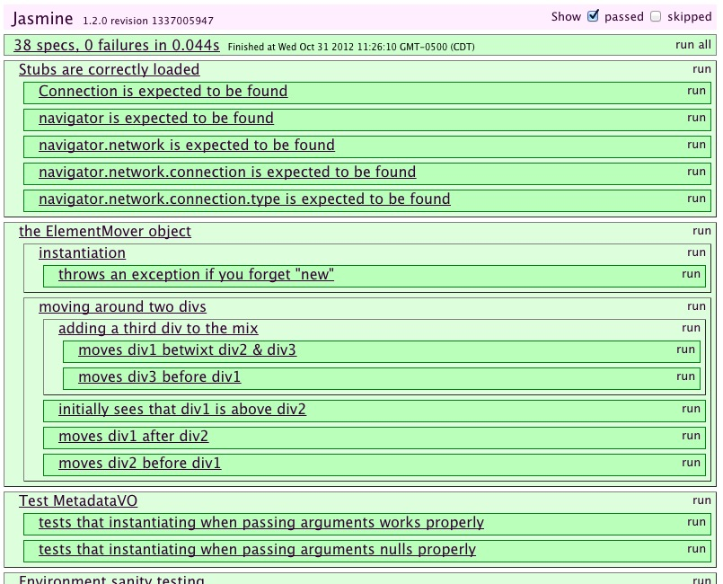
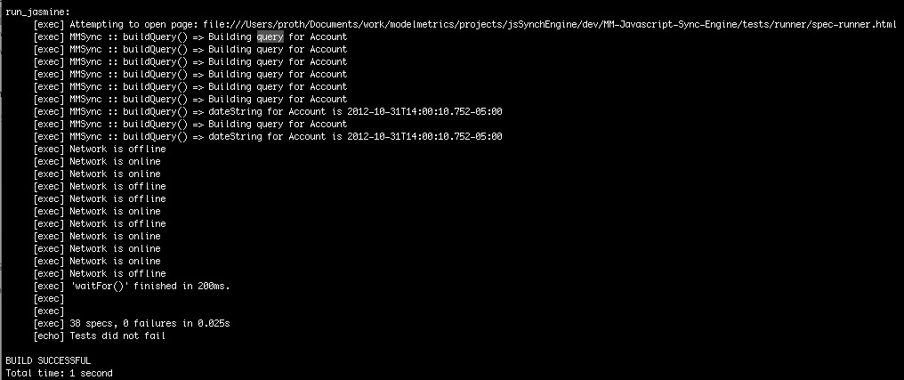

#Testing Overview

The Model Metrics JavaScript Synch Engine (MMJSE) provides Jasmine tests to ensure code quality that can be integrated into continuous integration (CI) processes.

Jasmine is a behavior-driven development framework that provides 'spec's to test javascript functionality and logic assumptions. Additional information can be found at: [http://pivotal.github.com/jasmine/](http://pivotal.github.com/jasmine/)

Jasmine tests can either be run through:

* a browser
* or through a 'headless' browser for automated testing.

Running the tests in the browser would be suitable for development or on a case by case basis.  Where a CI process (such as Jenkins) could be utilized to give system wide results and integrate with other processes (such as documentation).

##Running From the Browser

To run the tests from a local machine, simply open
**tests/runner/spec-runner.html**
in your browser.

Note the different sections:

* By default, only failures are shown. Clicking the appropriate checkboxes allow showing successful tests (including those passed) and skipped tests
* Tests are grouped by 'describe' headings, with individual assertions found below.

Modifying those tests and refreshing (occasionally holding down SHIFT+Refresh to ignore cache) will then run the tests again.

##Continuous Integration (CI)

PhantomJS is headless WebKit environment with JavaScript API. More information can be found at: [http://phantomjs.org/](http://phantomjs.org/)

An Apache Ant [http://ant.apache.org/](http://ant.apache.org/) 1.8+ project has been created to simplify running those tests.

###Installing PhantomJS

PhantomJS provides a number of ways to install, and many can be found on their installer page: [http://phantomjs.org/download.html](http://phantomjs.org/download.html)

PhantomJS can also be installed with a number of package managers, such as: homebrew or macports.  (The item to be certain is that it is 1.6+) Apt-get installs v1.5, which uses a different syntax to load.

Using Mac Ports

	sudo port install phantomjs
	
Using Homebrew

	brew install phantomjs

###Installing Apache Ant

Installers for Apache Ant can be found here: [http://ant.apache.org/bindownload.cgi](http://ant.apache.org/bindownload.cgi) - and can be installed either through binary (pre-compiled) or source code.

Users on a Macintosh will likely already have Apache Ant already installed, although this will likely be an older version (but still suitable).

Package managers could also be used, although can vary by difference.

Apt-Get

	apt-get install ant

Mac Ports

	port install apache-ant
	
HomeBrew
	
- Please see the following page: [http://seventy6.com/post/14175174562/how-to-upgrade-apache-ant-to-1-8-2-on-osx-using](http://seventy6.com/post/14175174562/how-to-upgrade-apache-ant-to-1-8-2-on-osx-using)

###Running PhantomJS

Once both PhantomJS and Apache Ant are installed, simply navigate to the base directory in your terminal and run the following command:

	$>ant

Note: console.log messages are echoed out to the console, such as 'Network is offline' in the previous image and can be used to debug statements.

However - console.log messages should be commented out to avoid polluting the test information if not needed.

#Working with Tests

All tests should be found under the **tests/** directory, with the following sub folders:

* specs - Jasmine Spec tests
* runner - Code used to run Jasmine tests among other CI tasks
* mocks - Code stubs used to bridge,overwrite or stem certain functionality needed for testing. (Such as missing functionality commonly found in Mobile but not in PhoneGap)
* stubs - JSON stub data used to mock data returned from SalesForce.com

##Spec-Runner.html

**New files (specs,stubs or data stubs) must be added to the tests/runner/spec-runner.html file.**

This file specifies the javascript files to include and often requires the javascript files to be included in a very specific order.

This ensures that they are available to Jasmine, so they can be used in running the tests.
